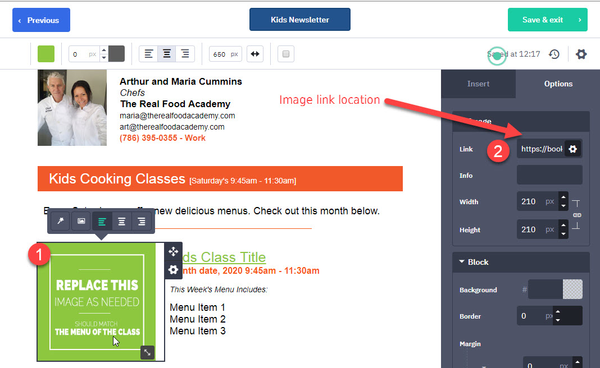

# Newletter Draft Creation
Each month TRFA sends out 2 newsletters to their customers base. One geared towards Kids, and another for the Adults. Maria completes the Bookeo classes for all categories ahead of schedule. Our job is to pick those up and place them into the appropriate newsletter. Art will complete the final step by adding the intro and subject line and notify tech to send the newsletter. 

## Schedule
The draft setup of each of the two newsletter should be completed no longer than the 24th of the month PRIOR to the Newsletter "Month". (ie: January 2020 must be completed by Dec 24th, 2019) 

It may be produced earlier, or done in segments as long as the final result is complete by the 24th. 

# Procedures

## Notifications
 * When Bookeo content is missing for the next period, notify Cenay
 * When unable to complete the task on time, notify Cenay

## Kids Newsletter
The Kids version of the newsletter typically contains 3 sections. 
 * Intro (the body of the email) - provided by Art/Cenay
 * Saturday Class section (Bookeo: Kids Cooking Classes)
 * [optional] Special Events section (Bookeo: Special Events)  
 _These can include:_  
   * Any Winter/Summer Camps
   * School holiday camps
   * Mommy and Me events
   * Gingerbread House Decorating 

The Bookeo content should be at least 4 weeks ahead of the current date, tho that won't always be the case. This content is inserted into Bookeo by Chef Maria, and updated/formatted by Cenay.

# Adults Newsletter
The Adults version of the newsletter typically contains 3, but can contain up to 4 sections. The optional section will be if there are any special events that invite the adults to come play with the kids. 
 * Intro (the body of the email) - provided by Art/Cenay
 * Adult Day Class section (Bookeo: Wednesday Daytime (Adults) )
 * Adult Evening Class section (Bookeo: Thursday Evening (Adult) )
 * [optional] Special Events (ie: Mommy and Me) (Bookeo: Special Events)
 
## Questions
 1. Where should "camps" go in the Kids Newsletter?
 2. Where should the "time and drop off" info go for the day camps? 
 
 
## Answers:
 1. Take the "info" from the Day Camp and use instead of Menu. Because this is a camp, they actually cook like 4 events with 2 - 3 items per, so the list would be really long. 
 2. Adult - evening class - valentines day is the winner. Explain the pasta entry not being visible until the prior "event" is done since they reuse it. 
 
# Links Used In The Newsletters
Images, buttons and links can be used in the newsletter to send customers to the appropriate sections of the website to purchase the classes. 

The location for the links can be seen in the images below. 
### Images 
Any images used in the newsletter should link to the class related. 

  

_Send tests to:_  
arthur@arthurcummins.com  
cenay@cenaynailor.com  

Kids Class Category  
https://bookeo.com/cookingwithkidsmiami?category=21464M9KX13EC482C116  

Special Events  
https://bookeo.com/cookingwithkidsmiami?category=214NCYPL616DCBF5CE5E  

Kids Camps (Includes all camps, weekly and daily)  
https://bookeo.com/cookingwithkidsmiami?category=214HTHYMU13ECCE7B340  

Winter Camp (Specifically)  
https://bookeo.com/cookingwithkidsmiami?type=214PLUHFY157CE44EA78  

Summer Camp (Specifically)  
https://bookeo.com/cookingwithkidsmiami?type=214RPTHWK13ECCFB7002  

Mommy and Me (Specifically)  
https://bookeo.com/cookingwithkidsmiami?type=2147NUJWL15695777311  

Adult Day Category  
https://bookeo.com/cookingwithkidsmiami?category=214NRJC3N159AD0FB015  

Adult Evening Category  
https://bookeo.com/cookingwithkidsmiami?category=2149H3RJR159AD0999C2  

Private Party (Adult)  
https://bookeo.com/cookingwithkidsmiami?type=214EWHUMF1491EC82C71  

Valentine's Day Special Event  
https://bookeo.com/cookingwithkidsmiami?type=214T9LXXL16F35DA3BCF  

